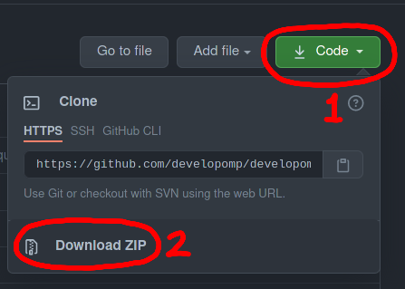

# developomp-site

Repository for my (developomp's) <a href="https://developomp.com" target="_blank">website</a>.

Tools/Frameworks/Packages used:

|                                                                          Name | Use                                                   |
| ----------------------------------------------------------------------------: | :---------------------------------------------------- |
|                                                 [AWS](https://aws.amazon.com) | Domain register                                       |
|                                       [Firebase](https://firebase.google.com) | Static site hosting                                   |
|                         [Typescript](https://github.com/microsoft/TypeScript) | Static typing for javascript                          |
|                                                  [react](https://reactjs.org) | Front end framework                                   |
|         [react-fontawesome](https://github.com/FortAwesome/react-fontawesome) | [Fontawesome](https://fontawesome.com) icons in react |
|                           [react-helmet](https://github.com/nfl/react-helmet) | HTML head management                                  |
|                              [dompurify](https://github.com/cure53/DOMPurify) | HTML sanitizer for markdown -> HTML page generation   |
|                   [gray-matter](https://github.com/jonschlinkert/gray-matter) | parsing markdown                                      |
| [local-storage-fallback](https://github.com/ripeworks/local-storage-fallback) | storing theme choice                                  |
|                      [react-tooltip](https://github.com/wwayne/react-tooltip) | Tooltips                                              |
|   [styled-components](https://github.com/styled-components/styled-components) | easier CSS styling                                    |
|         [styled-theming](https://github.com/styled-components/styled-theming) | Theming                                               |
|                                    [eslint](https://github.com/eslint/eslint) | code analysis                                         |
|                              [prettier](https://github.com/prettier/prettier) | code formatter                                        |
|                              [ts-node](https://github.com/TypeStrong/ts-node) | running markdown->html generator                      |
|                                                     [jest](https://jestjs.io) | code testing                                          |
|               [react-spinners](https://github.com/davidhu2000/react-spinners) | loading indicator                                     |

# Setup

Requirement:

-   [node](https://nodejs.org)
-   [yarn](https://github.com/yarnpkg/yarn) or [npm](https://github.com/npm/cli)\*
-   optional:
    -   [git](https://git-scm.com)
    -   [vscode](https://code.visualstudio.com)
        -   extensions (also optional but recommended):
            -   [styled components](https://marketplace.visualstudio.com/items?itemName=jpoissonnier.vscode-styled-components)
            -   [prettier](https://marketplace.visualstudio.com/items?itemName=esbenp.prettier-vscode)
            -   [react](https://marketplace.visualstudio.com/items?itemName=dsznajder.es7-react-js-snippets)
            -   [eslint](https://marketplace.visualstudio.com/items?itemName=dbaeumer.vscode-eslint)

\*Usage of yarn is highly recommended over npm

Steps:

-   Clone this repository
    -   `git clone https://github.com/developomp/developomp-site.git`
-   Or download compressed as zip
    -   
-   open [`source`](./source) directory
    -   `cd source`
-   Install dependencies (must be in `source` directory)
    -   `yarn install`
-   start local server in http://localhost:3000
    -   `yarn start`

# How it works

single page application
react to build front end
components
sunning `yarn generate` converts markdown to html and in json with parsed meta
by date, etc.
Does not scale well but I won't have 10k posts any time soon
few thousand so more than good enough

generator underscore
no symbolic links
filename encoder not perfect. Some filenames might cause problem.

# Contributing

Please read the [`CONTRIBUTING.md`](./CONTRIBUTING.md) file.

# Special thanks

-   design inspirations from [Ruipeng Zhang](https://github.com/ppoffice)'s [icarus theme](https://github.com/ppoffice/hexo-theme-icarus) for [hexo](https://github.com/hexojs/hexo).
-   dark theme color from [discord](http://discord.com)

# License

This project is licensed under the MIT License. 
Check the [LICENSE](./LICENSE) file for more information.

Font license:

[Open Font License (OFL)](./LICENSE_OFL) ([Source](https://scripts.sil.org/cms/scripts/page.php?site_id=nrsi&id=OFL#5667e9e4)):

-   [Source Code Pro](https://fonts.google.com/specimen/Source+Code+Pro?query=source+code+pro) (monospaced code font)
-   [Noto Sans KR](https://fonts.google.com/specimen/Noto+Sans+KR) (Korean and English font)
